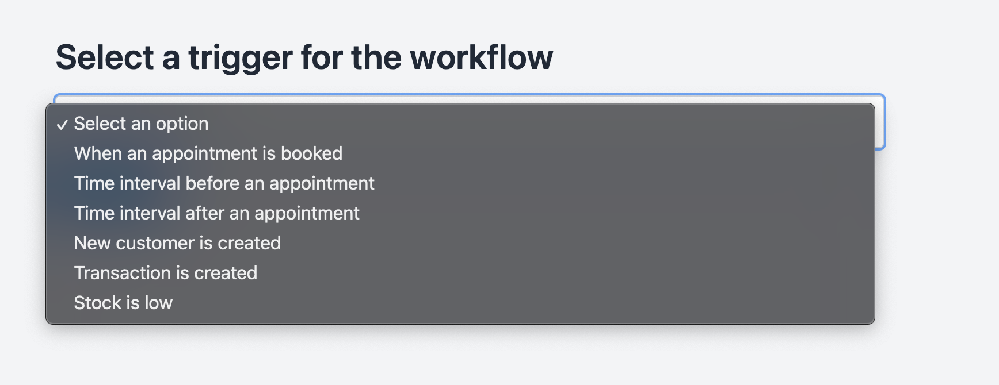
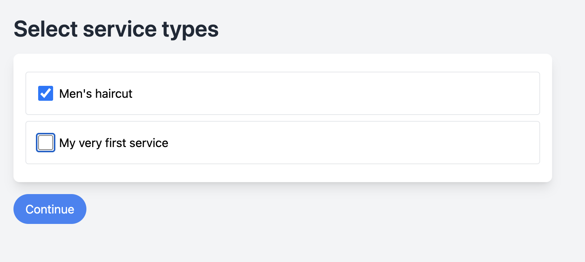
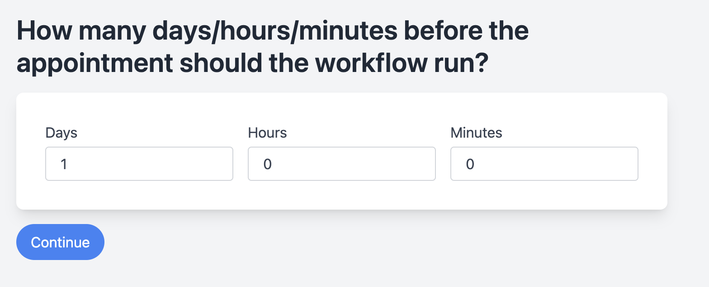
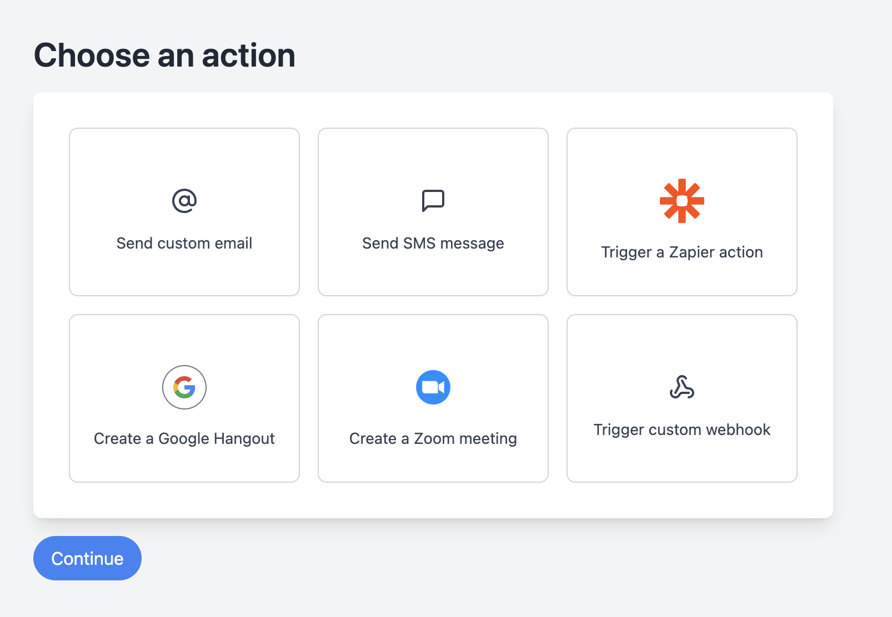

# Workflowy

## About the App

Workflowy is an integration hub for Noona HQ, enabling users to trigger actions based on events in Noona HQ.

With Workflowy, you can create workflows that are activated by specific events in Noona HQ. These workflows can be triggered immediately when an event occurs or scheduled to execute at a specified time before or after the event.

The app features a user-friendly wizard that guides users through the setup process, simplifying complexity and ensuring a smooth experience.

### Example Use Cases:
- Send a customized email two days before an appointment.
- Dispatch an NPS survey after an appointment.
- Trigger a Zapier Zap to add new customers to a Google Sheet or utilize any other Zapier functionality.
- Automatically create Google Hangouts/Zoom meetings.
- Trigger custom webhooks.
- Automatically send orders to suppliers when certain product stock is low.
- Send out automatic invoices.

### How It Works:

1. **Select a Trigger:**
   

2. **Configure Settings:**
   Adjust the relevant configurations for each trigger.
   
   
   

3. **Pick an Action:**
   

## Technology

This app is built with Remix.
📖 For more information, refer to the [Remix documentation](https://remix.run/docs) and the [Remix Vite documentation](https://remix.run/docs/en/main/guides/vite).

The data is stored in Firebase Firestore.

## Development

To develop locally, run the Firebase emulator since this project uses Firebase Firestore:
```shell
firebase init
firebase emulators:start
```

Start the Vite development server:
```shell
npm run dev
```

## Deployment

To deploy the app, follow these steps:

1. Build the app for production:
   ```sh
   npm run build
   ```

2. Deploy to Google Cloud Run:
   ```sh
   gcloud run deploy # This deploys the app
   firebase deploy --only functions # This deploys the function that acts as a CRON
   ```
   This process will create a Docker image from the source code, which is then deployed as a Google Cloud Run container. The container starts up when it receives requests and shuts down in between.

## Folders and Files

`/app`: Contains the code for the main application.

`/functions`: Contains a Firebase function that serves as a CRON job, calling the backend of the main app every 15 minutes.

`server.js`: The Node.js server that runs the Remix app in production.

## Code Quality

Please note, this code is not production-ready. It is a prototype developed quickly to demonstrate features. It lacks proper error handling, input validation, and correct TypeScript implementation. The only action that has currently been implemented is sending out emails.